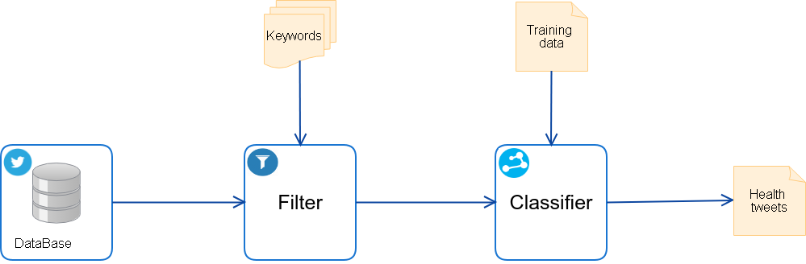

# Tweet-Classification

The aim of this project is to classify the health-related tweets.
We follow this pipeline :  

### DataBase:
To test our code, we put 15 Millions of tweets inside the folder "TweetFilter".

### TweetFilter:
This code is in scala + spark. It take a collection of tweets and do a filter based in a list of keywords (DataSetsHealth).
It do also the tweets cleaning (remove usernames, hashtags and URLs). 
Note: In this code, we give two list of keywords (DataSets + DataSetsHealth), one for sleep-apnea ailment and the other the health in general. You can add new list of keywords and do the filtering based on this list.

### TweetClassifier
After filtering, we use a binary classification. We put many models. Essentiallyw we worked with TF-IDF and Word2Vec for text representation. We used SVM or Logistic Regression.
For Word2Vec, we used GoogleNews-vectors-negative300.bin.gz pre-trained vectors ([Here](https://code.google.com/archive/p/word2vec/)).
- healthandnonhealth : trained data.
- tweets2017filtred1 : result of the filter. We put this in ordrer to test the models.
- classifiers- healthTweets : python script. Once executed, you can choose the model to lunch. We just put the parameters of the best trained models. You can add the parameters in order to do gridSearch on other training data.
